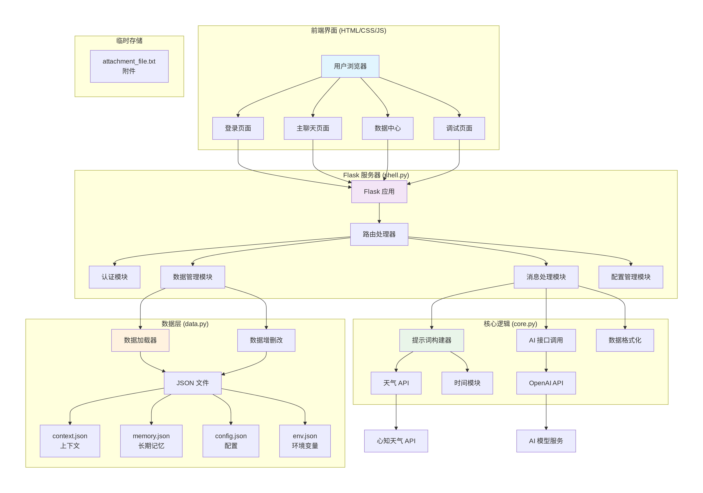

# Nino🍥
[简体中文](README.md) | [English](README_en.md)

Nino is a lightweight, open-source AI chat software focused on accompanying and understanding users. It can remember your preferences, habits, and important information, combining environmental factors such as time and weather to interact with you in a cute and gentle tone. It can be used for daily chatting, psychological adjustment, and other scenarios. All data is stored locally, ensuring privacy and security～

## 🌟 Features
- **Mutual companionship**: Communicates in a colloquial, cute, and playful tone, supporting simple emoticons and cute suffixes (w, meow, pinch, etc.)
- **Long-term memory**: Automatically records your personal information, preferences, and agreements, and you can also manually manage the memory library
- **Personalized replies**: Generates exclusive responses based on current time, weather, temperature, and chat context
- **Flexible configuration**: Supports switching thinking models (Deepseek-reasoner/chat), turning memory features on/off
- **Local data storage**: All chat records, memories, and configurations are saved locally, calling third-party APIs only when necessary
- **Responsive design**: Adapts to desktop and mobile, providing smooth chatting experience
- **Open source and free**: Based on GPL-3.0 license, freely modifiable and available for secondary development

## 🚀 Quick Start

Get started with Nino in 90 seconds. Just a few steps to complete installation and configuration, and start chatting happily～

Use [Python Source Code Deployment](#-1-python-source-code-deployment)

Use [Docker Deployment](#-2-docker-deployment)

### 1. Python Source Code Deployment
#### 1. Environment Requirements
- Python 3.8+

#### 2. Install Dependencies
##### Automatic Installation (Recommended)
Run the installation script in the project root directory:
```bash
python install.py
```
This script will automatically install the required dependencies and create the `env.json` configuration file.

##### Manual Installation
If automatic installation fails, you can manually execute the following commands:
```bash
pip install flask openai requests
```
Then manually create the `env.json` file with the following content:
```json
{
    "ai_api_key": "",
    "weather_api_key": ""
}
```

#### 3. Configure API Keys
Nino requires two API keys to work properly:
- **AI API Key**: Uses Deepseek API, needs to be obtained by registering at [Deepseek Official Website](https://www.deepseek.com/)
- **Weather API Key**: Uses Seniverse Weather API, needs to be obtained by registering at [Seniverse Official Website](https://www.seniverse.com/)

Fill the obtained keys into the corresponding fields in `env.json`.

#### 4. Start the Program
Run `shell.py` to start the Flask service:
```bash
python shell.py
```
After the service starts, access `http://127.0.0.1:5000` in your browser to use Nino for chatting～

### 2. Docker Deployment
#### 1. Environment Requirements
- Docker 19.XX+
- Docker Compose 1.XX+

#### 2. Deploy Service
Docker image is published at [snowball181/nino-ai-chat](https://hub.docker.com/r/snowball181/nino-ai-chat)
1. Create docker-compose.yml file
```yml
version: '3.8'  # Docker Compose file format version

services:
  nino:
    image: snowball181/nino-ai-chat:latest  # Use the Docker Hub image (recommend to replace with specific version number)
    container_name: nino-ai-chat  # Container name
    ports:
      - "5000:5000"  # Port mapping [host port:container port]
    volumes:
      - ./env.json:/app/env.json:ro  # Read-only mount of configuration file
      - nino-data:/app/data  # Persistent data volume
    restart: unless-stopped  # Automatically restarts on abnormal exit
    environment:  # Environment variables
      # - ai_api_key=your_ai_api_key_here
      # - weather_api_key=your_weather_api_key_here

    # networks:  # Custom networks can be uncommented if needed
    #   - nino-network
```
2. Start service
```bash
docker-compose up -d
```
#### 3. Environment Variables
| Variable Name | Required | Description |
| --- | --- | --- |
| ai_api_key | Y | Deepseek API Key |
| weather_api_key | Y | Xintzhi Weather API Key |

> Environment variables can be mounted through docker-compose.yml file, or set via docker's environment variables


## 🛠️ Tech Stack
- Backend: Python, Flask
- Frontend: HTML, CSS, jQuery
- Third-party dependencies: flask, openai, requests
- API services: Deepseek AI API, Seniverse Weather API
- Data storage: JSON files (local storage)

## 📊 Architecture Diagram



## ⚠️ Notes
1. AI replies may have "hallucinations" (fabricated information), please judge rationally, Nino and its author do not bear relevant responsibilities
2. API keys should be kept properly and not leaked to others

## 📜 Open Source License
This project is released under the **GPL-3.0 Open Source License**. You can freely use, modify, and distribute, but must retain the original author's copyright information, and derivative works must adopt the same license.

---

💖 Hope Nino can bring you warmth and happiness～